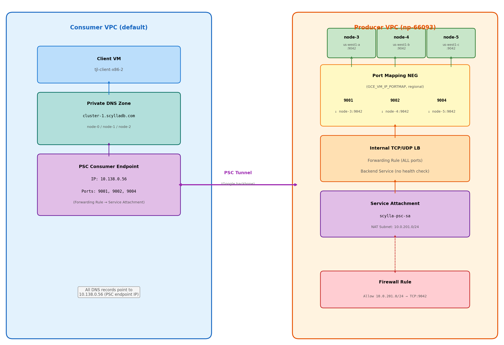

# GCP Private Service Connect with Port Mapping NEG

Terraform modules for exposing a ScyllaDB cluster through GCP Private Service Connect using a Port Mapping NEG (`GCE_VM_IP_PORTMAP`), enabling per-node routing through a single PSC endpoint.

## Architecture



### Traffic Flow

A client in the consumer VPC connects to the PSC endpoint IP on a node-specific port. The traffic traverses Google's backbone through the PSC tunnel and arrives at the producer-side Internal TCP/UDP Load Balancer. The Port Mapping NEG translates the destination port to the correct backend instance and port:

| Client Connects To | Client Port | Routed To             | Backend Port |
|---------------------|-------------|-----------------------|--------------|
| 10.138.0.56         | 9001        | node-3 (us-west1-a)  | 9042         |
| 10.138.0.56         | 9002        | node-4 (us-west1-b)  | 9042         |
| 10.138.0.56         | 9004        | node-5 (us-west1-c)  | 9042         |

## Modules

### psc-producer

Producer-side infrastructure deployed in the ScyllaDB VPC.

| Resource | Description |
|----------|-------------|
| **PSC NAT Subnet** | Dedicated subnet (e.g. `10.0.201.0/24`) for PSC network address translation. Consumer traffic arrives with source IPs from this range. |
| **Port Mapping NEG** | Regional `GCE_VM_IP_PORTMAP` NEG that maps client-facing ports to specific backend instances. Each endpoint maps one client port to one instance:port pair. **Key constraint: each instance can only appear once.** |
| **Backend Service** | Regional backend service with the port mapping NEG attached. Health checks are not supported with port mapping NEG backends. |
| **Forwarding Rule** | Internal passthrough LB forwarding rule with `all_ports=true`. Required as the target for the PSC service attachment. |
| **Service Attachment** | Exposes the forwarding rule to consumer VPCs. Uses the NAT subnet for address translation. |
| **Firewall Rule** | Permits traffic from the PSC NAT subnet to reach ScyllaDB nodes on the backend port. Without this, PSC traffic is silently dropped. |

### psc-consumer

Consumer-side infrastructure deployed in the client VPC.

| Resource | Description |
|----------|-------------|
| **PSC Consumer Endpoint** | Forwarding rule targeting the producer's service attachment, with a static internal IP (`GCE_ENDPOINT` purpose). |
| **Private DNS Zone** | Private DNS zone (e.g. `cluster-1.scylladb.com`) visible within the consumer VPC. |
| **DNS A Records** | Root domain and per-node records, all pointing to the PSC endpoint IP. |

## Usage

### Producer

```hcl
project_id = "my-project"
region     = "us-west1"

network = "scylladb-vpc"
subnet  = "scylladb-subnet"

nat_subnet_cidr = "10.0.201.0/24"
name_prefix     = "scylla-psc"

nodes = [
  {
    instance_self_link = "projects/my-project/zones/us-west1-a/instances/scylla-node-0"
    client_port        = 9001
    backend_port       = 9042
  },
  {
    instance_self_link = "projects/my-project/zones/us-west1-b/instances/scylla-node-1"
    client_port        = 9002
    backend_port       = 9042
  },
  {
    instance_self_link = "projects/my-project/zones/us-west1-c/instances/scylla-node-2"
    client_port        = 9004
    backend_port       = 9042
  },
]

connection_preference = "ACCEPT_AUTOMATIC"
```

### Consumer

```hcl
project_id = "consumer-project"
region     = "us-west1"

network = "default"
subnet  = "default"

service_attachment_id = "projects/my-project/regions/us-west1/serviceAttachments/scylla-psc-sa"

name_prefix = "scylla-psc"
dns_domain  = "cluster-1.scylladb.com"

nodes = [
  { name = "node-0", port = 9001 },
  { name = "node-1", port = 9002 },
  { name = "node-2", port = 9004 },
]
```

## Port Mapping NEG: The Round-Robin Limitation

### The Problem

In a `GCE_VM_IP_PORTMAP` NEG, **each VM instance can only appear once**. This means you cannot add a shared round-robin port (e.g. `9042`) alongside the per-node port mappings.

The current mappings work because each instance has exactly one entry:

| Client Port | Backend Instance | Backend Port |
|-------------|------------------|--------------|
| 9001        | node-3           | 9042         |
| 9002        | node-4           | 9042         |
| 9004        | node-5           | 9042         |

Adding round-robin on port 9042 would require three more entries — all of which fail:

| Client Port | Backend Instance | Backend Port | Result |
|-------------|------------------|--------------|--------|
| 9042        | node-3           | 9042         | **FAILS**: node-3 already has a mapping |
| 9042        | node-4           | 9042         | **FAILS**: node-4 already has a mapping |
| 9042        | node-5           | 9042         | **FAILS**: node-5 already has a mapping |

GCP returns `INVALID_ARGUMENT` because the constraint is **per-instance**, not per-port.

### Why

Port mapping NEGs are a 1:1 lookup table: `(client_port) → (instance, backend_port)`. The NEG acts as a port-based router, not a load balancer. There is no mechanism for multiple instances to share the same client-facing port.

### Workarounds

| Approach | Trade-off |
|----------|-----------|
| **CQL driver with all 3 ports** | Driver connects to 9001, 9002, 9004 directly — most ScyllaDB drivers handle multi-node topology natively. **Recommended.** |
| **Proxy VM** | HAProxy on a dedicated VM listening on 9042, round-robining to the 3 nodes. Adds a hop and a SPOF. |
| **Multiple PSC endpoints** | One PSC endpoint per node, each on port 9042. Consumer must create 3 forwarding rules + 3 IPs. |
| **Second NEG + second PSC** | Separate NEG with `9042→node-X:9042` for one node via a second service attachment. Not true round-robin. |

### Recommendation

Use the per-node ports (9001, 9002, 9004) as contact points in the CQL driver. The driver discovers the full topology after initial connection and routes queries to the correct node automatically — round-robin on the connection port is unnecessary.
